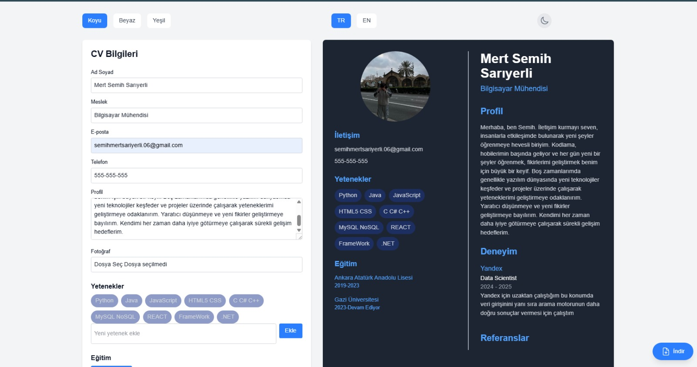
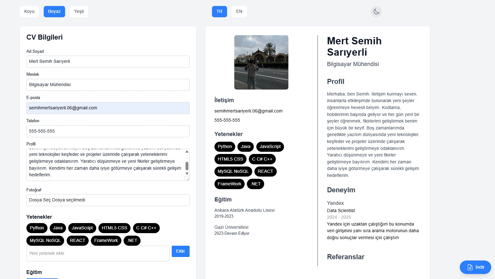
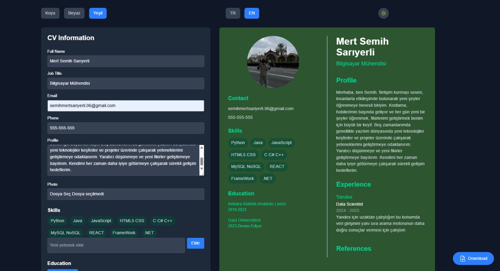
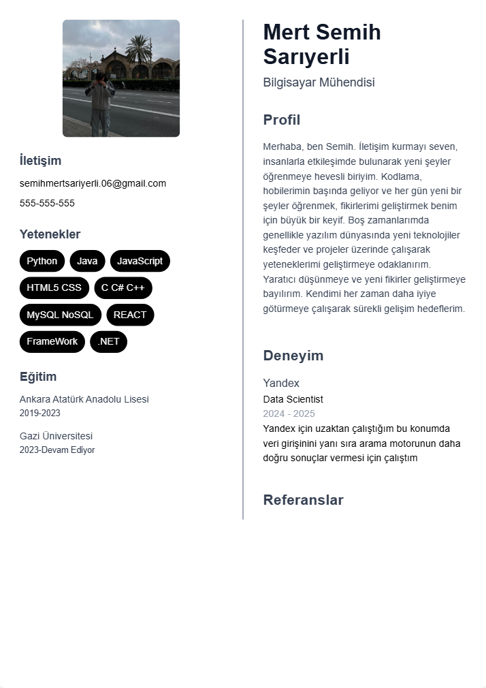

# CV Oluşturma Web Sitesi

Modern ve kullanıcı dostu bir CV oluşturma web uygulaması. Next.js ve Tailwind CSS kullanılarak geliştirilmiştir.

## Özellikler

### 1. Tema Seçenekleri
- **Koyu Tema**: Koyu mavi arka plan, beyaz metin
- **Beyaz Tema**: Beyaz arka plan, siyah metin
- **Yeşil Tema**: Koyu yeşil arka plan, beyaz metin

### 2. Dil Desteği
- Türkçe (TR)
- İngilizce (EN)

### 3. CV Bölümleri
- Kişisel Bilgiler
  - Ad Soyad
  - Meslek
  - E-posta
  - Telefon
  - Profil
  - Fotoğraf
- Yetenekler
- Eğitim
- Deneyim
- Referanslar

### 4. Özelleştirme Seçenekleri
- Karanlık/Aydınlık mod
- Tema değiştirme
- Dil değiştirme
- Fotoğraf yükleme
- Dinamik içerik ekleme/silme

### 5. Çıktı
- CV'yi PNG formatında indirme

## Teknolojiler

- Next.js 15.2.4
- TypeScript
- Tailwind CSS
- React
- html-to-image

## Kurulum

1. Projeyi klonlayın:
```bash
git clone https://github.com/mertsemih/cvsitesi.git
cd cvsitesi
```

2. Bağımlılıkları yükleyin:
```bash
npm install
```

3. Geliştirme sunucusunu başlatın:
```bash
npm run dev
```

4. Tarayıcınızda açın:
```
http://localhost:3000
```

## Kullanım

1. Sol taraftaki formu doldurun
2. Sağ tarafta canlı önizlemeyi görüntüleyin
3. İstediğiniz temayı seçin
4. Dil seçeneğini değiştirin
5. Karanlık/Aydınlık modu ayarlayın
6. CV'nizi PNG olarak indirin

## Ekran Görüntüleri


### Tema Seçenekleri ve Dil Seçenekleri
#### Koyu Tema


#### Beyaz Tema


#### Yeşil Tema


### CV Önizleme


## Lisans

Bu proje MIT lisansı altında lisanslanmıştır. Detaylar için [LICENSE](LICENSE) dosyasına bakın.

## İletişim

Sorularınız veya önerileriniz için:
- GitHub Issues
- E-posta: semihmertsariyerli.06@gmail.com


